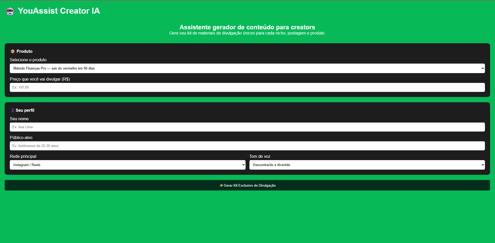

#  YouAssist Creator - Assistente inteligente para creators da YouShop

Ferramentas geradora de kits de divulgação para creators da YouShop. A partir de um formulário simples, cria roteiro de vídeo, legenda, e-mail e ângulo de conteúdo personalizados para o criador. A ferramenta também propoem filtragem de produtos enganosos.



## Como usar

1. Instale as dependências:
   ```bash
   pip install -r requirements.txt
   ```

2. Rode a aplicação:
   ```bash
   python app.py
   ```

3. Acesse `http://localhost:5000` no navegador, preencha o formulário e gere seu kit.

## O que é gerado

- **Ângulo único** — abordagem criativa diferenciada para o produto
- **Roteiro de vídeo** — adaptado para Instagram, TikTok ou YouTube
- **Legenda** — pronta para publicação nas redes sociais
- **E-mail** — para disparo para a base de contatos

## Produtos disponíveis

| Chave | Produto | Nicho |
|---|---|---|
| `financas` | Método Finanças Pro | Finanças pessoais |
| `marketing` | Fórmula de Lançamento Digital | Marketing digital |
| `saude` | Desafio 30 dias crescimento capilar | Saúde |

## Stack

- **Backend:** Python / Flask
- **Frontend:** HTML, CSS, JavaScript
